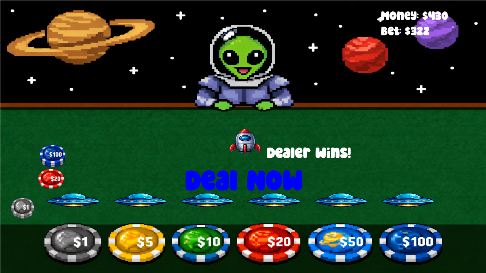
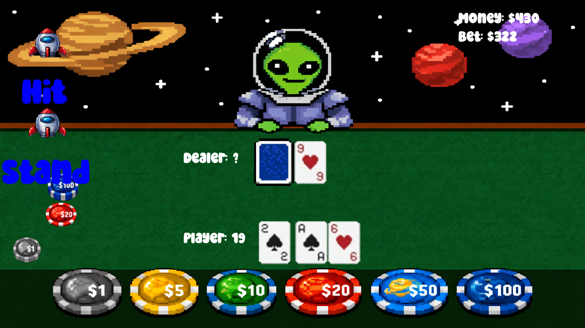
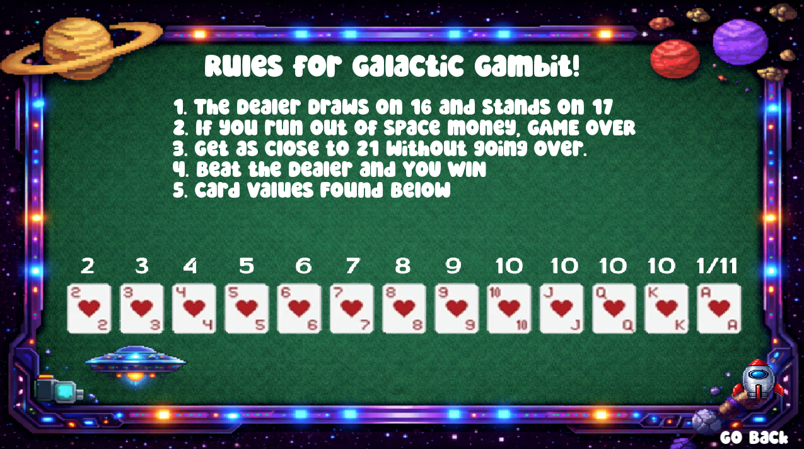

# Galactic Gambit

A sci-fi gambling game for CS-151 final, made by Braxton, Hayden, and Felix.


## How to setup

1. Open the Ubuntu terminal.

2. Update the terminal.

   ```bash
   sudo apt-get update && sudo apt-get upgrade -y
   ```

3. Install the GNU compiler tools.

   ```bash
   sudo apt-get install build-essential gdb
   ```

4. Install Git.

   ```bash
   sudo apt-get install git
   ```

5. Install SFML.

   ```bash
   sudo apt-get install libsfml-dev
   ```

6. Clone our repository.

   ```bash
   git clone https://github.com/Brax10P/Galactic-Gambit.git Gambit
   ```

7. Change into the directory.

   ```bash
   cd Gambit
   ```

8. Compile the game.

   ```bash
   g++ *.cpp -o Gambit -lsfml-system -lsfml-window -lsfml-graphics -lsfml-audio
   ```

   Or use the Makefile:

   ```bash
   make game
   ```

9. Run the executable.

   ```bash
   ./Gambit
   ```

   Or, if you used the Makefile:

   ```bash
   ./game
   ```

## Game Description

When you first start the game, you will be greeted by the friendly alien you are playing against. You will have the option to get right to gambling all your life savings away, or press the "How to Play" button to learn the values of cards and what your overall objective is. After that, it is off to watching your perfectly set up hand go south after drawing another 10.





## How to Play



## What We Learned

**Felix:** The main thing I learned would be the unique way I set up the cards for shuffling. Specifically, I learned to load the sprites into a vector with a for loop going through each line, and for shuffling I created a specific seed so that the values stayed with their assigned cards even though they were in separate vectors.

**Braxton:** I learned a lot about implementing SFML graphics using textures. I also learned a ton about implementing different buttons with different functionality. Specifically, I learned how to tweak object placement for proper orientation on the screen, how to make it look different when you hover over them, and how to hide certain buttons at certain times. I also learned how to implement a small timer to add slight delays for the dealer drawing cards and starting a new round when the player runs out of money.

**Hayden:** This project greatly increased my familiarization with how SFML graphics function, and by the end of this project, manipulating how elements appeared on screen and interacted with the program became very simple. This project also forced me to get used to organizing a project in a way where multiple parties can make significant parallel contributions without disrupting the whole. The desire for a more streamlined workflow made me strive to determine the best method for compartmentalizing all the different elements that make up the entirety of this project. We determined within the first week who would handle what major pillars of the project, and we did little deviation from that for the first three quarters of the project, but towards the end it was useful to have the other group members look at our separate areas of code with fresh eyes. The group aspect of this project motivated me to make my functions as intuitive as possible. Throughout our previous assignments this semester, the goal was for me to get the code to function as desired while remaining understandable by myself and the professor grading, but in this case I wanted to make the implementation and interactions between my and my partners' functions as simple as possible to minimize the amount of time the other group members might have to use to connect our separate functions to each other.


## What We'd do different
**Group:** in hindsight it seems there is some code that is spread throughout the project that is not neccessary due to being a bi-product
of using one of our previous assignments as a starting point for this program, with more time we could go through and verify whether some of this code is indeed not needed and remove it. We also believe the way our code is factored leaves something to be desired from an orginisational standpoint but given out limited knowledge this is what we believed would be most effecient and intuitive for out skill level. Making the texture assets sheets more even would have minimized the amount of tedious adjustments required for a large portion of the assets used. 